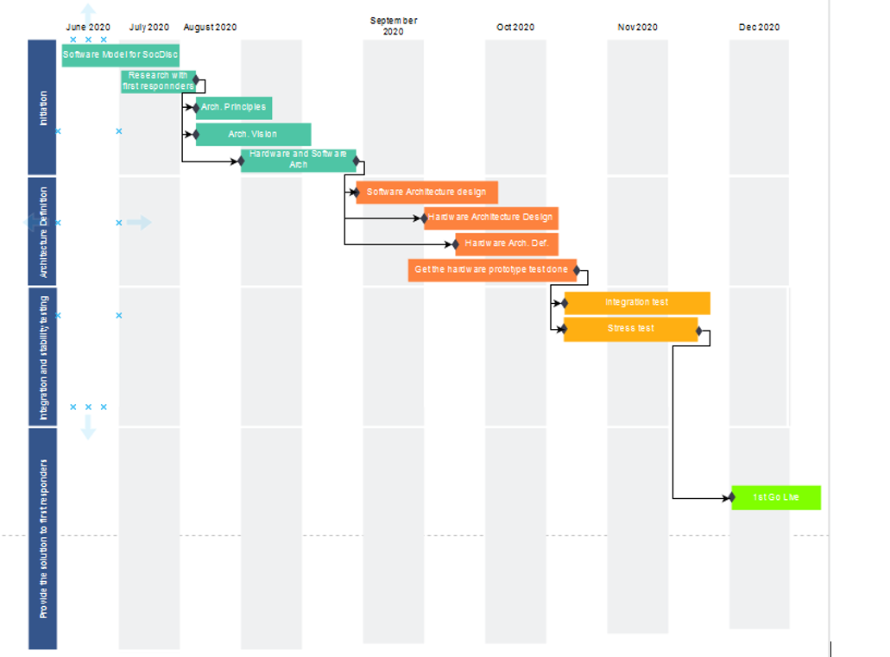
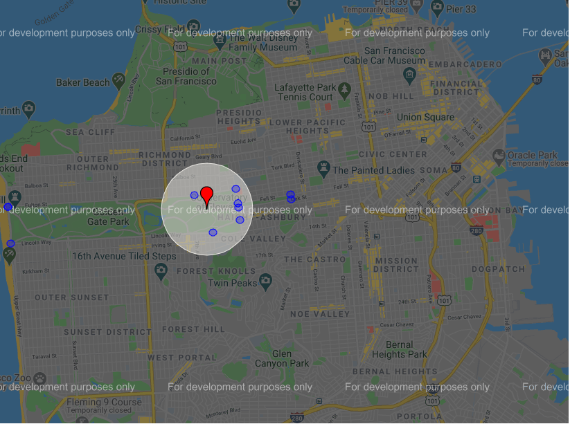

# Submission name
SOC-DISC (WINTechon-Hackathon). This library enables existing smart-watch to help user's fight against any contagious diseases like H1N1, Covid-19 etc. Getting Started You can use this library locally in any simulator development environment. Just import the library and Happy development. This library depends on sensor based data like temperature, touch etc. It also uses user’s location. Dependencies This library is using following python libraries: JSON Beeply GMAP Features User will get notifications whenever: • User’s temperature is more than X • User has done a handshake • User is defying social distancing norms

# Shortdescription
    Covid-19 is having an unprecedented impact on our society and our economy. There has been a surge in the demand of medical facilities. SOC-DISC This library enables existing smart-watch to help user's fight against any contagious diseases like H1N1, Covid-19 etc.
    
# Demo video

  
#    Long description:
    Covid-19 is having an unprecedented impact on our society and our economy. There has been a surge in the demand of medical facilities. In these difficult times returning to work or normalcy for many people is mandatory. While we return to normalcy keeping oneself safe and following the social distancing norms gets very difficult. Smart medical sensors and Internet of things devices can be used to provide an alert to the person using the device so that he can take appropriate actions. In this prototype we propose to solve these problems by providing alerts to the user through a beep. 

    Here we expect to obtain data from smart sensors present in the wearable worn around wrist. We use simulated data in our prototype to alert the user when the person has fever, or has done a handshake, or has come in proximity of another person violating the social distance norms. There is a map generated which shows the presence of people within the proximity.

# Project roadmap

# Getting started:
## Prerequisite
Phython 3.x
Pip 3.x
## Libraries to install
beeply,  bokeh.io, random, gmplot.

## Run the Project
python3 SO-DISC.py

# People near you

The number of people and their locations within the defined radius are shown in blue,and self who is wearing the strip is shown in red color on the map.

The same map can be used to check if any person within defined radius has temperature(in Red) and people with normal temperature within defined radius are shown in(Blue) 

